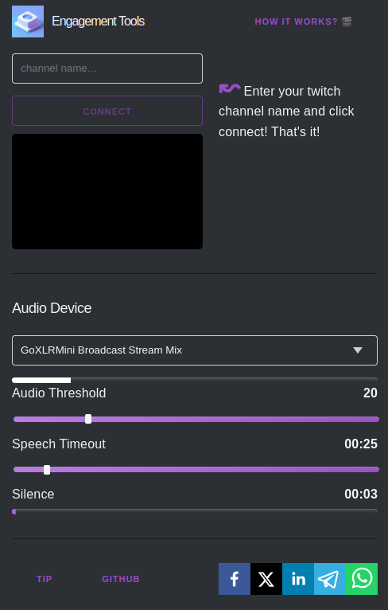

# Engagement-Tools

Test Engagement-Tools: [https://egtools.app/](https://egtools.app/)

Engagement-Tools is designed to enhance interaction during live streams.

It actively detects periods of silence and prompts users to engage, ensuring a lively and engaging atmosphere.

Additionally, it monitors chat activity, measuring messages per minute, and automatically lists new chat users for personalized greetings.

Thank you for using the Engagement-Tools, and happy livestreaming!

## Settings
**Audio Threshold:** This setting refers to the minimum volume level that the app will recognize as speech. You can adjust this setting to make the app more or less sensitive to speech.

**Silence sensitivity:** This setting determines how sensitive the app is to periods of silence. The user can adjust this value to make the app more or less sensitive to silence. The larger the value, the longer you have to talk to reset the silence.

**Speech timeout:** This setting determines the maximum duration of silence before the app issues a warning to the user. The user can adjust this value to set the maximum time allowed for silence before the app prompts the user to speak up.

**Silence:** This setting allows the user to monitor the duration and frequency of periods of silence during their livestream.
